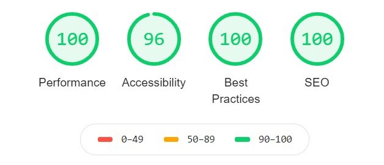

# Pricing component with pure css interactions and own Gulp tasks
:iphone: Website is fully responsive

Live URL: [https://sleepy-kare-9151b6.netlify.app/](https://sleepy-kare-9151b6.netlify.app/)

## Technology stack
  - SCSS
  - HTML
  - Gulp (tasks: compiles sass, minify files and optimize images)

## Preview design
Design come from [Frontend Mentor](https://frontendmentor.io) website and it is a one of their challenges.

## Lighthouse report

